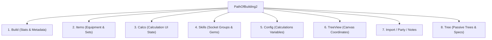

# Path of Building 2 (PoB2) XML Schema Specification

This document provides a detailed schema specification for Path of Building 2 (`.xml` or compressed `.code`) build files, based on the `big_pob2.xml` example and the parser logic in `pob2Parser.js`.

---

## 1. Overview of the XML Tree

A PoB2 XML file is structured around a single root `<PathOfBuilding2>` element containing several main sections:



---

## 2. Detailed Schema by Section

### Root Node: `<PathOfBuilding2>`
The root container node for the entire document.
- **Child Elements**: `<Build>`, `<Items>`, `<Calcs>`, `<Skills>`, `<Config>`, `<TreeView>`, `<Import>`, `<Party>`, `<Notes>`, `<Tree>`.

---

### Section 1: `<Build>`
Contains character class details, build level, active buffs, and calculated player stats.

#### Attributes:
* **`className`** (string): The base character class (e.g. `"Druid"`, `"Ranger"`, `"Warrior"`, `"Witch"`).
* **`ascendClassName`** (string): The ascendancy class (e.g. `"Shaman"`, `"None"`).
* **`mainSocketGroup`** (integer): Index of the primary active socket group.
* **`level`** (integer): The character's level.
* **`viewMode`** (string): View configuration in PoB (e.g. `"IMPORT"`, `"TREE"`).
* **`characterLevelAutoMode`** (boolean): `"true"` or `"false"`.
* **`targetVersion`** (string): Internal version code (e.g. `"0_1"`).

#### Child Elements:
* **`<PlayerStat>`** (multiple): Holds static calculation values for tooltips and stats.
  * *Attributes*:
    * `stat` (string): The name of the calculated stat (e.g., `"AverageDamage"`, `"Life"`, `"ColdResist"`).
    * `value` (decimal string): The calculated value of the stat.
* **`<Buffs>`** (single): Lists currently active buffs.
  * *Attributes*:
    * `combatList` (string): Active combat buffs (comma-separated).
    * `buffList` (string): General active buffs.
    * `curseList` (string): Active curses.
* **`<TimelessData>`** (single): Custom data for timeless jewels.

---

### Section 2: `<Items>`
Holds the database of items defined in the build and maps them to item sets.

#### Attributes:
* **`useSecondWeaponSet`** (boolean): Whether the swap weapon set is active.
* **`activeItemSet`** (integer): The active `<ItemSet>` ID (e.g. `"1"`).
* **`showStatDifferences`** (boolean): Whether to compare stats with current setup.

#### Child Elements:
* **`<Item>`** (multiple): An individual equipment or jewel definition.
  * *Attributes*:
    * `id` (integer): Unique identifier for this item within the build.
    * `variant` (optional, integer): Active variant index for uniques.
    * `variantAlt` (optional, integer): Secondary variant index.
  * *Text Content*: The standard multi-line PoB item text block (Rarity, Name, Item Type, modifiers, quality, implicits, sockets, etc.).
  * *Children*:
    * **`<ModRange>`** (multiple): Explicit range values for variable rolls on the item.
      * *Attributes*:
        * `range` (float): A value between `0.0` and `1.0` representing the roll value.
        * `id` (integer): ID of the modifier line this range applies to.
* **`<ItemSet>`** (multiple): A configuration of slotted items.
  * *Attributes*:
    * `id` (integer): Unique set ID.
    * `title` (string): User-defined name of the item set (e.g. `"Default"`, `"Endgame"`).
  * *Children*:
    * **`<Slot>`** (multiple): Slotted item references.
      * *Attributes*:
        * `name` (string): The name of the inventory slot (e.g. `"Helmet"`, `"Amulet"`, `"Weapon 1"`, `"Body Armour"`, `"Weapon 2"`, `"Gloves"`, `"Ring 1"`, `"Ring 2"`, `"Belt"`, `"Boots"`, `"Weapon 2 Swap"`).
        * `itemId` (integer): Refers to `<Item id="...">`. `0` denotes an empty slot.
        * `itemPbURL` (optional, string): Import URL for the item.

---

### Section 3: `<Calcs>`
Maintains calculation GUI settings (used mainly to restore UI state in PoB2).

#### Child Elements:
* **`<Input>`** (multiple): Option settings for calculations.
  * *Attributes*: `name` (string) + `number` or `string` or `boolean` (the option value).
* **`<Section>`** (multiple): UI sections.
  * *Attributes*: `id` (string), `subsection` (string), `collapsed` (boolean).

---

### Section 4: `<Skills>`
Defines socket groups, active gems, and support links grouped into skill sets.

#### Attributes:
* **`activeSkillSet`** (integer): ID of the active skill set.
* **`sortGemsByDPS`** (boolean): Whether to sort gem list by DPS contributions.
* **`defaultGemLevel`** (string/integer): Gem level default config.
* **`defaultGemQuality`** (integer): Gem quality default config.

#### Child Elements:
* **`<SkillSet>`** (multiple): Groups different skill setups (e.g. `"Twister Levelling"`, `"Endgame"`).
  * *Attributes*:
    * `id` (integer): Unique skill set ID.
    * `title` (string): Custom title for this setup.
  * *Children*:
    * **`<Skill>`** (multiple): Represents a single socket group.
      * *Attributes*:
        * `enabled` (boolean): Whether this socket group is active.
        * `mainActiveSkill` (integer): Index of the main active gem within this group.
        * `mainActiveSkillCalcs` (integer): Index used for calculation focus.
        * `includeInFullDPS` (boolean): Whether to sum this skill in full build DPS.
        * `label` (string): Optional custom tag.
        * `source` (optional, string): The source of the skill (e.g. `"Explode"` if granted by an item).
      * *Children*:
        * **`<Gem>`** (multiple): Individual active or support gem in this socket group.
          * *Attributes*:
            * `gemId` (string): BaseItemTypes metadata path (e.g. `Metadata/Items/Gems/SkillGemTwister`).
            * `nameSpec` (string): Friendly name.
            * `level` (integer): Gem level.
            * `quality` (integer): Gem quality.
            * `enabled` (boolean): Whether this gem is active.
            * `variantId` (string): Variant ID of the gem.
            * `skillId` (string): Internal engine skill identifier (e.g. `TwisterPlayer`).
            * `count` (integer): Number of instances.

---

### Section 5: `<Config>`
Specifies calculation flags, combat states (e.g., "Enemy is Shocked"), custom mods, and custom placeholders.

#### Child Elements:
* **`<ConfigSet>`** (multiple): Holds configurations.
  * *Attributes*: `id` (integer), `title` (string).
  * *Children*:
    * **`<Input>`** (multiple): Active inputs config.
      * *Attributes*: `name` (string) + either `boolean`, `number`, or `string` values.
    * **`<Placeholder>`** (multiple): Expected values for combat fields that are not set.
      * *Attributes*: `name` (string), `number` (decimal string).

---

### Section 6: `<Tree>`
Contains the active passive tree selection and one or more passive specs.

#### Attributes:
* **`activeSpec`** (integer): The ID of the currently selected tree spec.

#### Child Elements:
* **`<Spec>`** (multiple): A version of the passive skill tree (e.g. leveling tree vs endgame tree).
  * *Attributes*:
    * `title` (string): Title of the tree stage.
    * `classId` (integer): Base class ID.
    * `ascendClassId` (integer): Ascendancy class ID.
    * `treeVersion` (string): Game version targeted (e.g. `"0_4"`).
    * `nodes` (comma-separated integers): List of allocated Passive tree node IDs.
    * `masteryEffects` (string): Allocated mastery stats.
  * *Children*:
    * **`<URL>`** (single): Official Path of Exile 2 passive skill tree website link (contains binary-encoded tree nodes).
    * **`<Sockets>`** (single): Maps socket node IDs to jewel item IDs.
      * *Children*:
        * `<Socket>` (multiple):
          * *Attributes*: `nodeId` (integer), `itemId` (integer).
    * **`<Overrides>`** (single): Allocated attribute adjustments.
      * *Children*:
        * `<AttributeOverride>` (single):
          * *Attributes*: `dexNodes` (comma-separated integers), `intNodes` (comma-separated integers), `strNodes` (comma-separated integers).
    * **`<WeaponSet1>`, `<WeaponSet2>`** (optional, single): Node overrides allocated only when switching active weapon sets.
      * *Attributes*: `nodes` (comma-separated integers).

---

## 3. TypeScript Schema (Post-Parsed Domain Object)

The parsed output returned by the build importer conforms to the following TypeScript interfaces.

```typescript
export interface Pob2Build {
  className: string | null;
  ascendancyName: string | null;
  passives: string[]; // Fully mapped node ID string arrays (e.g. ["strength89"])
  skills: Pob2Skill[];
  inventory_slots: Pob2InventorySlot[];
  itemSets: Pob2ItemSet[];
  trees: Pob2TreeSpec[];
  skillSets: Pob2SkillSet[];
}

export interface Pob2TreeSpec {
  title: string;
  passives: string[]; // PassiveSkills table IDs
  level_interval: [number, number]; // [minLevel, maxLevel]
}

export interface Pob2SkillSet {
  title: string;
  skills: Pob2Skill[];
}

export interface Pob2Skill {
  id: string; // BaseItemTypes path (e.g. "Metadata/Items/Gems/SkillGemEarthquake")
  level_interval: [number, number]; // [minLevel, maxLevel]
  additional_text: string;
  support_skills: Pob2SupportSkill[];
}

export interface Pob2SupportSkill {
  id: string; // BaseItemTypes support gem path
  level_interval: [number, number];
  additional_text: string;
}

export interface Pob2ItemSet {
  id: string;
  title: string;
  inventory_slots: Pob2InventorySlot[];
}

export interface Pob2InventorySlot {
  inventory_id: string; // "Helm1", "Weapon1", etc.
  additional_text: string; // Fully extracted modifiers and item details block
}
```
